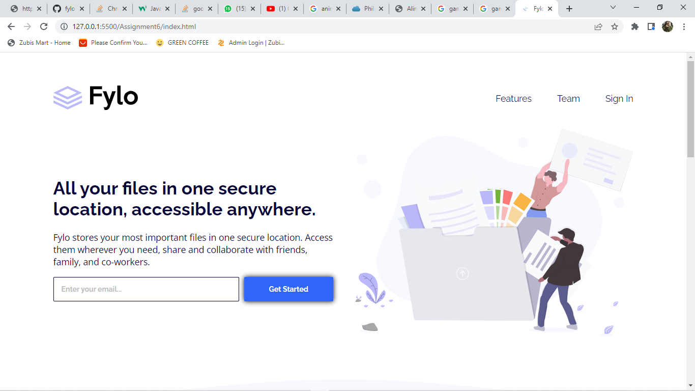
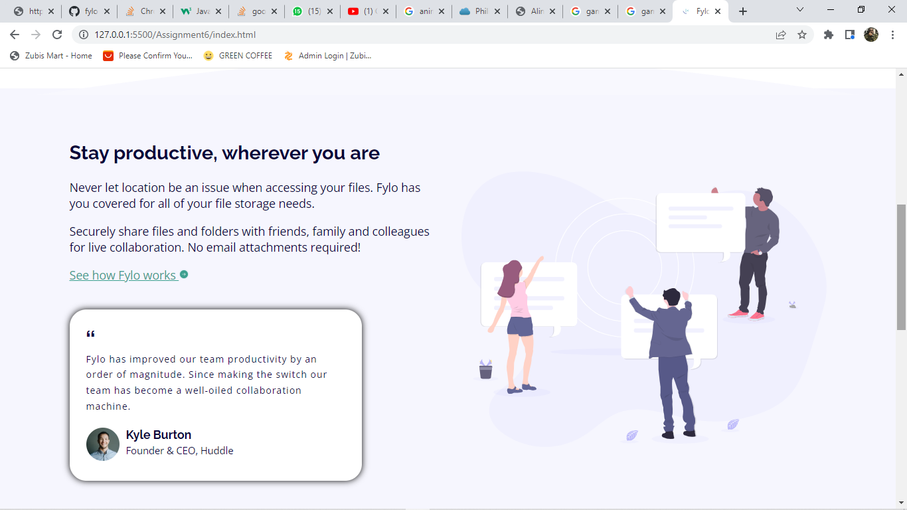
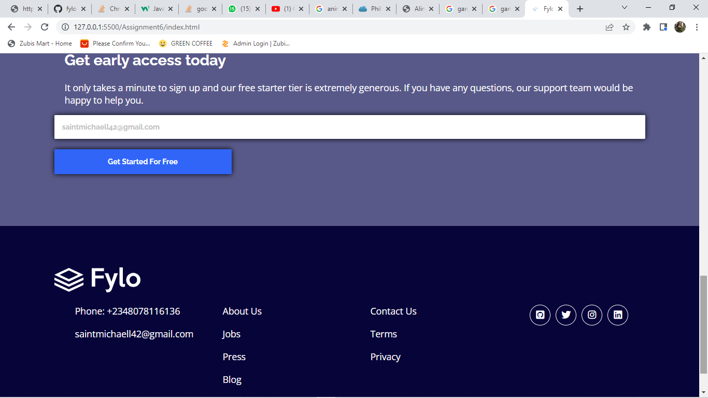
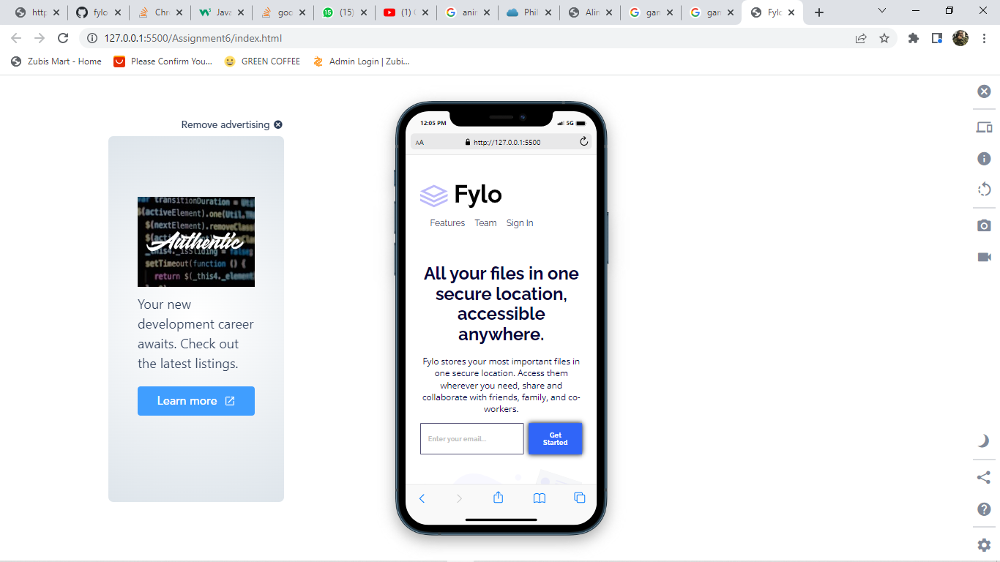
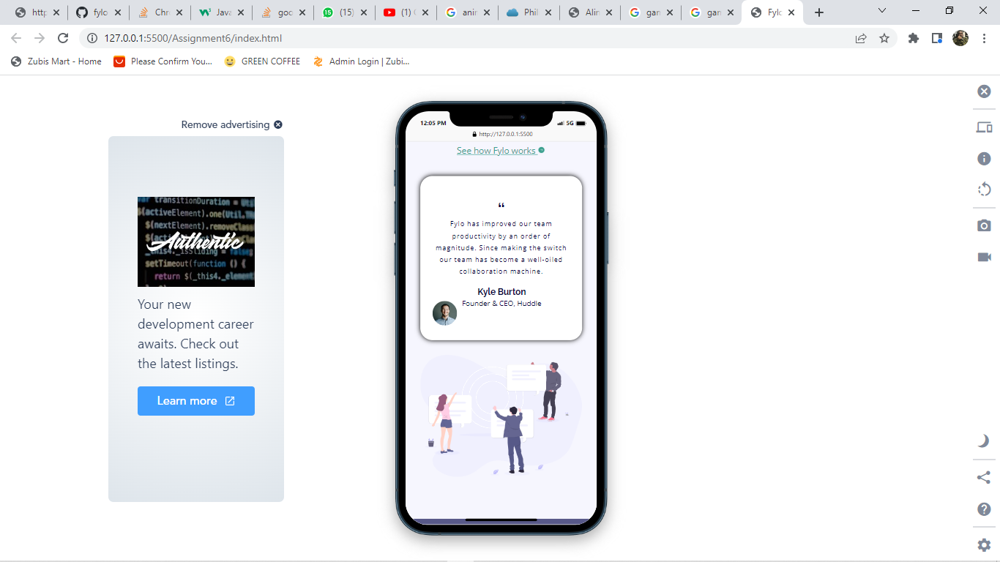
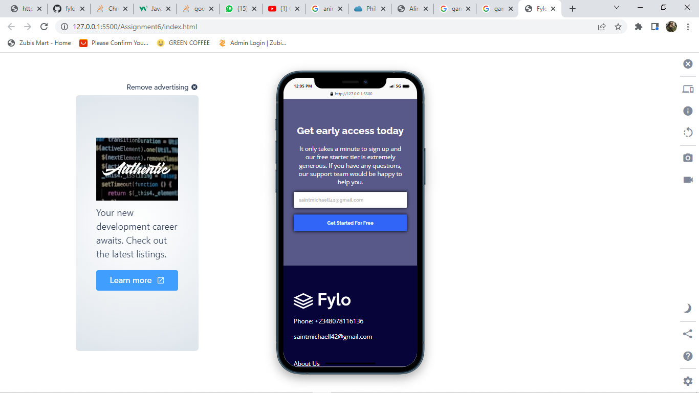
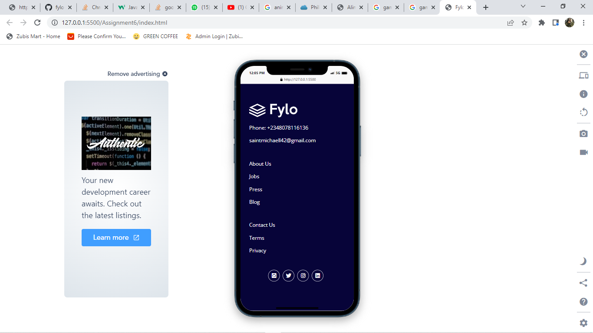

# Fylo landing page with two column layout

## Table of contents

- [Overview](#overview)
  - [The challenge](#the-challenge)
  - [Screenshot](#screenshot)
  - [Links](#links)
- [My process](#my-process)
  - [Built with](#built-with)
  - [What I learned](#what-i-learned)
  - [Continued development](#continued-development)
  - [Useful resources](#useful-resources)
- [Author](#author)
- [Acknowledgments](#acknowledgments)

## Overview

### The challenge

Users should be able to:

- View the optimal layout for the site depending on their device's screen size
- See hover states for all interactive elements on the page

### Screenshot

Screenshots of mobile and desktop views
### Links

- Live Site URL: [https://saintt042.github.io/fylo-landing-page/](https://your-live-site-url.com)

## My process

### Built with

- Semantic HTML5 markup
- CSS custom properties
- Flexbox
- CSS Grid
- Mobile-first workflow
- [HTML]
- [CSS]
- [Styled Components](https://styled-components.com/) - For styles

### What I learned

I learnt a great deal on media query while working on this

### Continued development
I would really love to keep focusing on mediaQuery. This to me is my major challenge in CSS, proves difficult may times but I have always found a way around it, just need to be faster

## Author

- Website - [https://saintt042.github.io/First-portfolio/](https://www.your-site.com)
- Frontend Mentor - [https://www.frontendmentor.io/profile/Saintt042](https://www.frontendmentor.io/profile/yourusername)
- Twitter - [https://twitter.com/SaintMichaell](https://www.twitter.com/yourusername)

## Acknowledgments
I want to specially thank my team mates<a href = "https://twitter.com/Web3Bridge" target ="_blank">@web3bridge africa</a> for their continued support as we grow together in this tech field and also special thanks to my mentor <a href = "https://twitter.com/jolah99" target ="_blank">@Jolade</a> for her continued encouragement and support. 